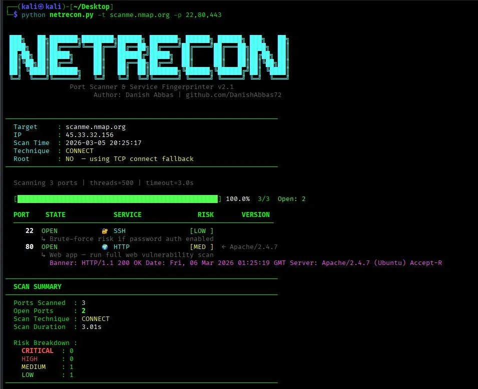
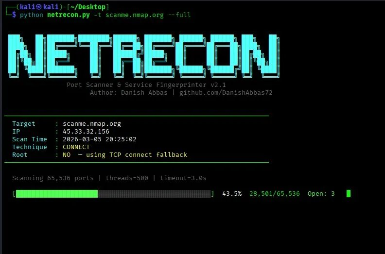

# NetRecon 🔍
### Advanced Port Scanner & Service Fingerprinter

<div align="center">

```
 ███╗   ██╗███████╗████████╗██████╗ ███████╗ ██████╗ ██████╗ ███╗   ██╗
 ████╗  ██║██╔════╝╚══██╔══╝██╔══██╗██╔════╝██╔════╝██╔═══██╗████╗  ██║
 ██╔██╗ ██║█████╗     ██║   ██████╔╝█████╗  ██║     ██║   ██║██╔██╗ ██║
 ██║╚██╗██║██╔══╝     ██║   ██╔══██╗██╔══╝  ██║     ██║   ██║██║╚██╗██║
 ██║ ╚████║███████╗   ██║   ██║  ██║███████╗╚██████╗╚██████╔╝██║ ╚████║
 ╚═╝  ╚═══╝╚══════╝   ╚═╝   ╚═╝  ╚═╝╚══════╝ ╚═════╝ ╚═════╝ ╚═╝  ╚═══╝
               Port Scanner & Service Fingerprinter v1.1
```


**Author: Danish Abbas | [github.com/DanishAbbas72](https://github.com/DanishAbbas72)**

</div>

---

## 📌 Table of Contents

- [What Is NetRecon](#-what-is-netrecon)
- [Features](#-features)
- [Screenshots](#-screenshots)
- [Installation](#-installation)
- [Quick Start](#-quick-start)
- [All Commands & Options](#-all-commands--options)
- [Usage Examples](#-usage-examples)
- [Firewall Bypass Techniques](#-firewall-bypass-techniques)
- [Risk Rating System](#-risk-rating-system)
- [Supported Services](#-supported-services-50)
- [How It Works](#-how-it-works)
- [Troubleshooting](#-troubleshooting)
- [Legal Disclaimer](#-legal-disclaimer)

---

## 🔍 What Is NetRecon?

**NetRecon** is a Python-based advanced port scanner and service fingerprinter built for penetration testers, bug bounty hunters, and security researchers.

It performs **multi-threaded TCP port scanning** across any IP or hostname, identifies running services, grabs live service banners, extracts software version numbers, and assigns a **risk rating** (CRITICAL / HIGH / MEDIUM / LOW) to every open port — giving you immediate insight into the security posture of a target.

NetRecon also implements **7 firewall bypass techniques** including FIN/NULL/XMAS stealth scans with intelligent iptables management, source port spoofing, packet fragmentation, and IDS evasion through port randomization and scan delays.

**Built entirely on Python standard library — zero pip install required. Works on any system with Python 3.6+.**

---

## ✨ Features

| Feature | Details |
|---|---|
| **Multi-threaded scanning** | Up to 500+ threads for blazing fast results |
| **Full port range** | Scan all 65,535 ports with `--full` |
| **Service fingerprinting** | Identifies 50+ services by port number |
| **Banner grabbing** | Protocol-aware probes (HTTP HEAD, SMTP EHLO, Redis INFO) |
| **Version detection** | Extracts OpenSSH, Apache, nginx, MySQL versions from banners |
| **Risk rating** | CRITICAL / HIGH / MEDIUM / LOW per port |
| **Security notes** | Pentest context for every open service |
| **FIN scan** | Bypasses stateless firewalls with iptables RST suppression |
| **NULL scan** | No TCP flags — bypasses some packet filters |
| **XMAS scan** | FIN+PSH+URG flags — bypasses BSD-based filters |
| **ACK scan** | Maps which ports the firewall passes |
| **Source port spoofing** | Bind to port 53/80 to bypass trusted-port firewall rules |
| **Packet fragmentation** | Fragment TCP packets to bypass stateless firewalls |
| **IDS evasion** | Randomized port order + configurable scan delay |
| **Reverse DNS** | Auto-resolves IP to hostname |
| **Report export** | Save results to text file with `-o report.txt` |
| **Color-coded output** | Clean, readable terminal results |
| **Zero dependencies** | Pure Python — no pip install needed |

---

## 📸 Screenshots

### Specific Port Scan — Service Detection & Banner Grabbing



*Scanning ports 22, 80, 443 on scanme.nmap.org — SSH and HTTP detected with Apache/2.4.7 version fingerprinting and live HTTP banner grab*

---

### Full Scan — All 65,535 Ports with Live Progress



*Full scan of all 65,535 ports with real-time progress bar — showing 43.5% complete, 28,501 ports scanned, 3 open ports found live*

---

## 📦 Installation

### Requirements

- Python **3.6** or higher
- Linux / Kali Linux (recommended)
- `sudo` / root access for advanced scan techniques (FIN, NULL, XMAS, ACK)

### Step 1 — Clone the Repository

```bash
git clone https://github.com/DanishAbbas72/netrecon.git
cd netrecon
```

### Step 2 — Verify Python Version

```bash
python3 --version
# Should show Python 3.6 or higher
```

### Step 3 — Run It

```bash
python netrecon.py --help
```

**That's it. No pip install. No virtual environment. No dependencies.**

### On Kali Linux (Recommended)

```bash
git clone https://github.com/DanishAbbas72/netrecon.git
cd netrecon
python netrecon.py -t target.com --top
```

---

## ⚡ Quick Start

```bash
# Scan top 120 common ports
python netrecon.py -t target.com --top

# Scan specific ports
python netrecon.py -t 192.168.1.1 -p 22,80,443

# Full scan — all 65,535 ports
python netrecon.py -t 192.168.1.1 --full

# Firewall bypass with trusted source port
python netrecon.py -t target.com --top --source-port 53

# Stealth FIN scan (requires root)
sudo python netrecon.py -t target.com --top --fin-scan

# Save results to file
python netrecon.py -t target.com --top -o report.txt
```

---

## 📖 All Commands & Options

```
usage: netrecon [-h] -t TARGET [-p PORTS | --top | --full]
                [--fin-scan | --null-scan | --xmas-scan | --ack-scan]
                [--source-port PORT] [--fragmentation] [--ttl TTL]
                [--randomize] [--delay DELAY] [--threads THREADS]
                [--timeout TIMEOUT] [--no-banner] [-o OUTPUT]
                [--no-color] [--techniques]
```

### 🎯 Target

| Flag | Description | Example |
|---|---|---|
| `-t`, `--target` | Target IP, hostname, or CIDR subnet | `-t 192.168.1.1` |

### 🔢 Port Selection *(choose one)*

| Flag | Description | Example |
|---|---|---|
| `-p`, `--ports` | Custom ports or range | `-p 22,80,443` or `-p 1-10000` |
| `--top` | Scan top 120 common pentesting ports | `--top` |
| `--full` | Scan ALL 65,535 ports (0-65535) | `--full` |
| *(default)* | Scans ports 1–1024 if nothing specified | — |

### 🕵️ Scan Technique *(choose one, root required)*

| Flag | Description | Root |
|---|---|---|
| `--fin-scan` | FIN probe + TCP verify — Linux/iptables-aware | ✅ |
| `--null-scan` | NULL scan (no flags) — bypasses stateless filters | ✅ |
| `--xmas-scan` | XMAS scan (FIN+PSH+URG) — bypasses BSD-based filters | ✅ |
| `--ack-scan` | ACK scan — maps which ports the firewall allows | ✅ |

> Without sudo, all techniques automatically fall back to TCP Connect scan.

### 🔥 Firewall Bypass Options

| Flag | Description | Example |
|---|---|---|
| `--source-port PORT` | Spoof source port to bypass trusted-port firewall rules | `--source-port 53` |
| `--fragmentation` | Fragment TCP packets (bypass stateless firewalls) | `--fragmentation` |
| `--ttl VALUE` | Custom IP TTL value | `--ttl 128` |
| `--randomize` | Randomize port order (evade IDS/IPS signatures) | `--randomize` |
| `--delay SECONDS` | Delay between probes (evade rate-limit detection) | `--delay 0.1` |

### ⚡ Performance Options

| Flag | Description | Default |
|---|---|---|
| `--threads N` | Number of concurrent threads | `500` |
| `--timeout N` | Socket timeout per port in seconds | `3.0` |
| `--no-banner` | Skip banner grabbing for faster scan | Off |

### 💾 Output Options

| Flag | Description | Example |
|---|---|---|
| `-o`, `--output` | Save scan results to a text file | `-o report.txt` |
| `--no-color` | Disable colored terminal output | `--no-color` |
| `--techniques` | Show firewall bypass technique reference | `--techniques` |

---

## 💡 Usage Examples

### Basic Scans — No Root Needed

```bash
# Scan a hostname — top common ports
python netrecon.py -t target.com --top

# Scan an IP address
python netrecon.py -t 192.168.1.1 --top

# Scan specific ports only
python netrecon.py -t 192.168.1.1 -p 22,80,443,3306,8080

# Scan a port range
python netrecon.py -t 192.168.1.1 -p 1-10000

# Scan all 65,535 ports (takes ~6 min for remote targets)
python netrecon.py -t scanme.nmap.org --full

# Save results to report
python netrecon.py -t 192.168.1.1 --top -o report.txt

# Fast scan — no banners, high threads
python netrecon.py -t 192.168.1.1 --full --no-banner --threads 1000 --timeout 1.5

# Disable color output (for piping/logging)
python netrecon.py -t 192.168.1.1 --top --no-color
```

### Firewall Bypass Scans — No Root Needed

```bash
# Source port 53 — bypass rules trusting DNS traffic
python netrecon.py -t target.com --top --source-port 53

# Source port 80 — bypass rules trusting web traffic
python netrecon.py -t target.com --top --source-port 80

# Randomized port order — evade IDS pattern detection
python netrecon.py -t target.com --top --randomize

# Slow stealth scan — stay under rate-limit thresholds
python netrecon.py -t target.com --top --delay 0.1 --randomize

# Combined bypass
python netrecon.py -t target.com --top --source-port 53 --randomize --delay 0.05 -o report.txt
```

### Advanced Raw Scans — Root Required

```bash
# FIN scan (Linux-aware — uses iptables RST suppression)
sudo python netrecon.py -t 192.168.1.1 --top --fin-scan

# NULL scan — no TCP flags
sudo python netrecon.py -t 192.168.1.1 --top --null-scan

# XMAS scan — FIN + PSH + URG flags
sudo python netrecon.py -t 192.168.1.1 --top --xmas-scan

# ACK scan — maps firewall rules (shows UNFILTERED ports)
sudo python netrecon.py -t 192.168.1.1 -p 1-1000 --ack-scan

# FIN + randomize + report
sudo python netrecon.py -t 192.168.1.1 --top --fin-scan --randomize -o report.txt

# Packet fragmentation
sudo python netrecon.py -t 192.168.1.1 --top --fragmentation

# Custom TTL packet crafting
sudo python netrecon.py -t 192.168.1.1 --top --ttl 128

# Full stealth combination
sudo python netrecon.py -t 192.168.1.1 --top --fin-scan --randomize --delay 0.05 -o report.txt
```

### Subnet / Network Scanning

```bash
# Scan entire /24 subnet — top ports
python netrecon.py -t 192.168.1.0/24 --top

# Scan subnet — specific ports
python netrecon.py -t 10.0.0.0/24 -p 22,80,443,3306
```

### View Bypass Technique Reference

```bash
python netrecon.py -t x --techniques
```

---

## 🔥 Firewall Bypass Techniques

| Technique | How It Bypasses the Firewall |
|---|---|
| `--source-port 53` | Firewall rules often allow traffic from "trusted" ports like DNS (53). Binding to this source port makes probes appear to come from a DNS server. |
| `--source-port 80` | Same trick using HTTP port — firewalls allowing inbound web traffic may pass these packets. |
| `--fragmentation` | Splits TCP packets into small fragments. Stateless firewalls inspect individual packets and cannot reassemble them to detect the scan. |
| `--fin-scan` | Sends FIN flag. RFC 793 states only closed ports reply RST — open ports silently drop it. Bypasses firewalls that only block SYN packets. |
| `--null-scan` | No TCP flags set. Abnormal packet that confuses some stateless packet inspection systems. |
| `--xmas-scan` | FIN + PSH + URG flags. Bypasses certain BSD-based and older firewall implementations. |
| `--ack-scan` | Sends ACK packets. RST response = port is unfiltered (firewall passes it). No response = filtered. Used to map firewall rules, not find open ports. |
| `--randomize` | Randomizes port scan order. Breaks sequential pattern signatures used by IDS/IPS systems to detect scans. |
| `--delay 0.1` | Adds delay between probes. Keeps scan rate under thresholds that trigger rate-limit based IDS alerts. |
| `--ttl 128` | Sets custom IP TTL. Evades some TTL-based filtering and OS fingerprinting rules. |

### How FIN Scan Works on Linux Targets

NetRecon implements a **two-phase FIN scan** that correctly handles Linux/iptables DROP policies:

```
Phase 1 — Raw FIN Probe (fast, simultaneous)
  ↓  Send FIN probes to all target ports at once
  ↓  Add iptables rules to stop YOUR kernel from auto-RST'ing responses
  ↓  Collect RST responses from target = CLOSED ports
  ↓  Ports with no RST response = possibly OPEN or FILTERED
                      ↓
Phase 2 — TCP Connect Verify (accurate)
  ↓  Run TCP connect only on non-RST ports
  ↓  Connect succeeds = truly OPEN ✅
  ↓  Connect fails    = FILTERED, not open ❌
  ↓  iptables rules cleaned up automatically in finally block
```

---

## 🎯 Risk Rating System

| Rating | Color | Meaning | Common Examples |
|---|---|---|---|
| 🔴 **CRITICAL** | Red Bold | Commonly exploitable, often direct RCE or full compromise | Redis, MongoDB, VNC, Telnet, SMB, Elasticsearch |
| 🟠 **HIGH** | Red | High-value attack surface requiring immediate attention | MySQL, RDP, FTP, LDAP, SNMP, PostgreSQL |
| 🟡 **MEDIUM** | Yellow | Potential security risk — investigate further | HTTP, SMTP, DNS, IMAP, Node/Grafana |
| 🟢 **LOW** | Green | Generally secure protocol — review config and version | SSH, HTTPS, IMAPS, POP3S, SMTP/TLS |

### Why HTTP is MEDIUM and SSH is LOW

**HTTP (Port 80) = MEDIUM** — Web applications are the #1 attack surface:
- SQL Injection, XSS, IDOR, File Upload, RCE
- Exposed admin panels (`/admin`, `/phpmyadmin`, `/wp-admin`)
- Directory traversal and path disclosure
- Outdated CMS (WordPress, Joomla, Drupal)
- One open port = entire web application attack surface

**SSH (Port 22) = LOW** — Designed to be secure:
- All traffic is strongly encrypted
- Risk only exists if password auth is enabled (brute-force)
- Or if running a severely outdated version with known CVEs
- Same rating used by Nessus, OpenVAS, and Qualys

---

## 📡 Supported Services (50+)

| Port | Service | Risk | Pentest Note |
|---|---|---|---|
| 21 | FTP | HIGH | Check anonymous login, banner grab for version |
| 22 | SSH | LOW | Brute-force risk if password auth enabled |
| 23 | Telnet | CRITICAL | Unencrypted — credentials in plaintext |
| 25 | SMTP | MEDIUM | Open relay, user enumeration (VRFY/EXPN) |
| 53 | DNS | MEDIUM | Zone transfer (AXFR), cache poisoning |
| 80 | HTTP | MEDIUM | Full web vulnerability scan needed |
| 110 | POP3 | MEDIUM | Email — check for cleartext auth |
| 139 | NetBIOS | HIGH | Null sessions, SMB enumeration |
| 143 | IMAP | MEDIUM | Email — check for cleartext auth |
| 161 | SNMP | HIGH | Default community strings (public/private) |
| 389 | LDAP | HIGH | Anonymous bind check |
| 443 | HTTPS | LOW | TLS cert + web vulnerability scan |
| 445 | SMB | CRITICAL | EternalBlue/MS17-010 |
| 512 | RSH | CRITICAL | Remote Shell — no authentication |
| 513 | rlogin | CRITICAL | Legacy remote login — highly insecure |
| 1433 | MSSQL | HIGH | Default creds sa/blank |
| 1521 | Oracle | HIGH | Default SIDs and credentials |
| 2049 | NFS | HIGH | World-readable shares |
| 3306 | MySQL | HIGH | Remote root access check |
| 3389 | RDP | HIGH | BlueKeep CVE-2019-0708, brute-force |
| 5432 | PostgreSQL | HIGH | Remote access check |
| 5900 | VNC | CRITICAL | Weak or no authentication |
| 6379 | Redis | CRITICAL | No auth by default — full RCE risk |
| 6443 | Kubernetes | CRITICAL | K8s API — unauthenticated access |
| 7001 | WebLogic | HIGH | Deserialization CVEs (CVE-2020-14882) |
| 8080 | HTTP-Alt | MEDIUM | Tomcat/Jenkins/proxy — web scan needed |
| 8888 | Jupyter | CRITICAL | No auth — arbitrary code execution |
| 9200 | Elasticsearch | CRITICAL | No auth default — full data access |
| 27017 | MongoDB | CRITICAL | No auth default — full DB access |
| + 25 more | ... | ... | ... |

---

## ⚙️ How It Works

```
Step 1 — DNS Resolution
         Hostname → IP using 6-method fallback resolver
         Works under sudo via raw DNS + getent + dig + host
                      ↓
Step 2 — Port Scanning
         Non-blocking TCP connect with select()
         Each port gets a configurable timeout window
         500 threads run simultaneously by default
                      ↓
Step 3 — Banner Grabbing
         Protocol-aware probes sent per port
         HTTP HEAD request, SMTP EHLO, Redis INFO, etc.
                      ↓
Step 4 — Version Fingerprinting
         Regex patterns extract version strings from banners
         OpenSSH 6.6.1, Apache/2.4.7, nginx/1.18, MySQL 5.7...
                      ↓
Step 5 — Risk Rating
         Port matched against 50+ entry service database
         CRITICAL / HIGH / MEDIUM / LOW assigned with pentest note
                      ↓
Step 6 — Output
         Color-coded terminal table with risk highlighting
         Optional text report export with -o flag
```

---

## 📁 Repository Structure

```
netrecon/
│
├── netrecon.py          ← Main tool (single file, zero dependencies)
├── README.md            ← This file
├── requirements.txt     ← No dependencies required
└── screenshots/
    ├── screenshot1.png  ← Specific port scan output
    └── screenshot2.png  ← Full 65,535 port scan in progress
```

---

## 🔧 Troubleshooting

### No open ports found on a target I know has open ports

```bash
# Increase timeout for slow or distant targets
python netrecon.py -t target.com --top --timeout 5

# Try source port bypass
python netrecon.py -t target.com --top --source-port 53

# Use IP instead of hostname
python netrecon.py -t 45.33.32.156 --top
```

### FIN / NULL / XMAS scan shows 0 results

```bash
# Must use sudo for raw scan techniques
sudo python netrecon.py -t 192.168.1.1 --top --fin-scan

# Use IP directly under sudo (avoids DNS issues)
sudo python netrecon.py -t 45.33.32.156 --top --fin-scan

# Preserve environment variables
sudo -E python netrecon.py -t target.com --top --fin-scan
```

### sudo cannot resolve hostname

```bash
# Best — use IP directly (always works)
sudo python netrecon.py -t 45.33.32.156 --top --fin-scan

# Alternative — preserve environment
sudo -E python netrecon.py -t scanme.nmap.org --top --fin-scan
```

### Full scan is too slow

```bash
# Increase threads and reduce timeout
python netrecon.py -t target.com --full --threads 1000 --timeout 1.5 --no-banner
```

### Permission denied on raw socket

```bash
# Raw socket scans need root
sudo python netrecon.py -t target.com --top --fin-scan
```

---

## ⚖️ Legal Disclaimer

> **This tool is intended for authorized security testing and educational purposes only.**
>
> - Only scan systems you **own** or have **explicit written permission** to test
> - Unauthorized port scanning may be **illegal** in your jurisdiction
> - The author takes **no responsibility** for any misuse of this tool
> - Always follow responsible disclosure practices
> - Respect bug bounty program scope and rules at all times

---

## 👤 Author

**Danish Abbas** — Cybersecurity Researcher | Penetration Tester | Bug Bounty Hunter

| | |
|---|---|
| **GitHub** | [github.com/DanishAbbas72](https://github.com/DanishAbbas72) |
| **LinkedIn** | [linkedin.com/in/danish-abbas-132411216](https://linkedin.com/in/danish-abbas-132411216) |
| **Email** | danish.abbas.infosec@gmail.com |
| **Bug Bounty** | YesWeHack · Bugcrowd |
| **Security Research** | [github.com/DanishAbbas72/security-research](https://github.com/DanishAbbas72/security-research) |

---

## 📜 License

This project is licensed under the MIT License.

---

<div align="center">

*Built with Python standard library only. Zero external dependencies.*

⭐ **Star this repo if NetRecon helped you!**

</div>
